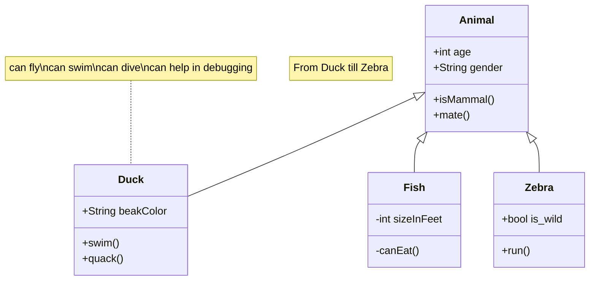
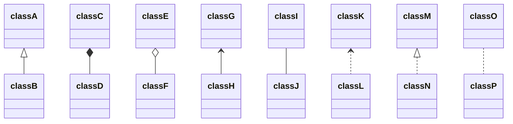
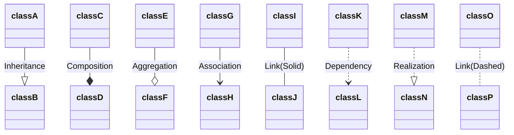
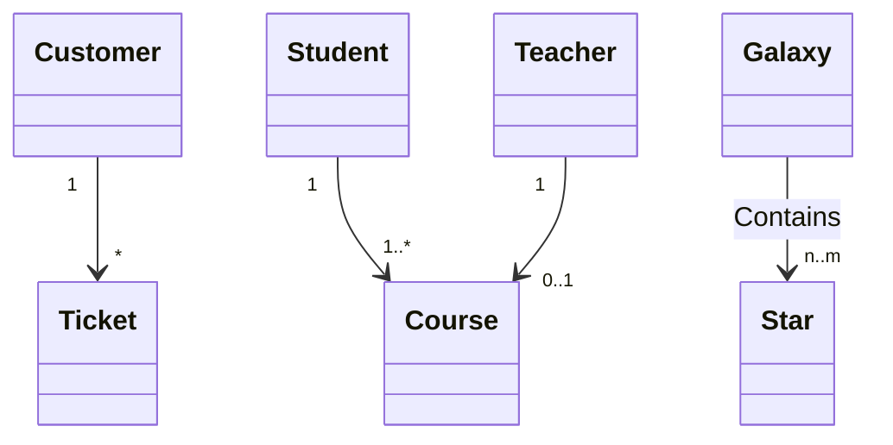
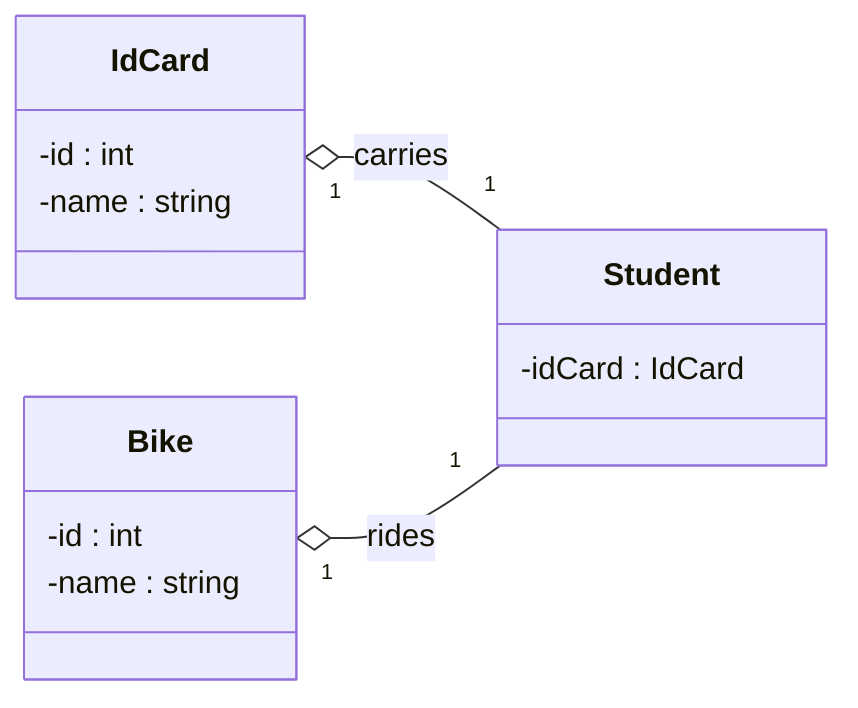
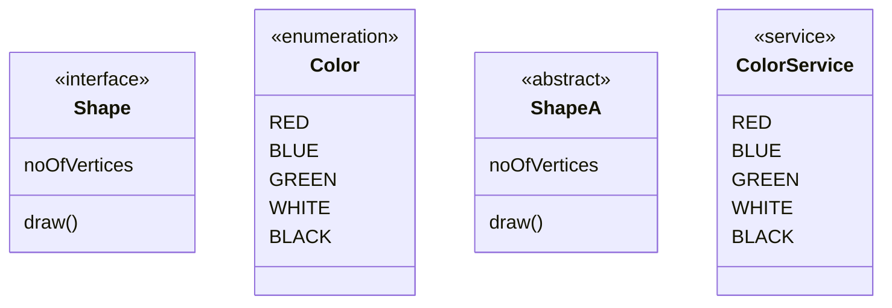

# Class Diagram

## Example 1

```mermaid
classDiagram
    note "From Duck till Zebra"
    Animal <|-- Duck
    note for Duck "can fly\ncan swim\ncan dive\ncan help in debugging"
    Animal <|-- Fish
    Animal <|-- Zebra
    Animal : +int age
    Animal : +String gender
    Animal: +isMammal()
    Animal: +mate()
    class Duck{
        +String beakColor
        +swim()
        +quack()
    }
    class Fish{
        -int sizeInFeet
        -canEat()
    }
    class Zebra{
        +bool is_wild
        +run()
    }
```

## Example 2

```mermaid
classDiagram
classA <|-- classB
classC *-- classD
classE o-- classF
classG <-- classH
classI -- classJ
classK <.. classL
classM <|.. classN
classO .. classP
```

## Example 3

```mermaid
classDiagram
classA --|> classB : Inheritance
classC --* classD : Composition
classE --o classF : Aggregation
classG --> classH : Association
classI -- classJ : Link(Solid)
classK ..> classL : Dependency
classM ..|> classN : Realization
classO .. classP : Link(Dashed)
```

## Example 4

```mermaid
classDiagram
    Customer "1" --> "*" Ticket
    Student "1" --> "1..*" Course
    Galaxy --> "n..m" Star : Contains
    Teacher "1" --> "0..1" Course
```

## Example 5

```mermaid
classDiagram
  direction RL
  class Student {
    -idCard : IdCard
  }
  class IdCard{
    -id : int
    -name : string
  }
  class Bike{
    -id : int
    -name : string
  }
  Student "1" --o "1" IdCard : carries
  Student "1" --o "1" Bike : rides
```

## Example 6

```mermaid
classDiagram
class Shape{
    <<interface>>
    noOfVertices
    draw()
}
class Color{
    <<enumeration>>
    RED
    BLUE
    GREEN
    WHITE
    BLACK
}
class ShapeA{
    <<abstract>>
    noOfVertices
    draw()
}
class ColorService{
    <<service>>
    RED
    BLUE
    GREEN
    WHITE
    BLACK
}
```
