# Sequence Diagram

## Example 1

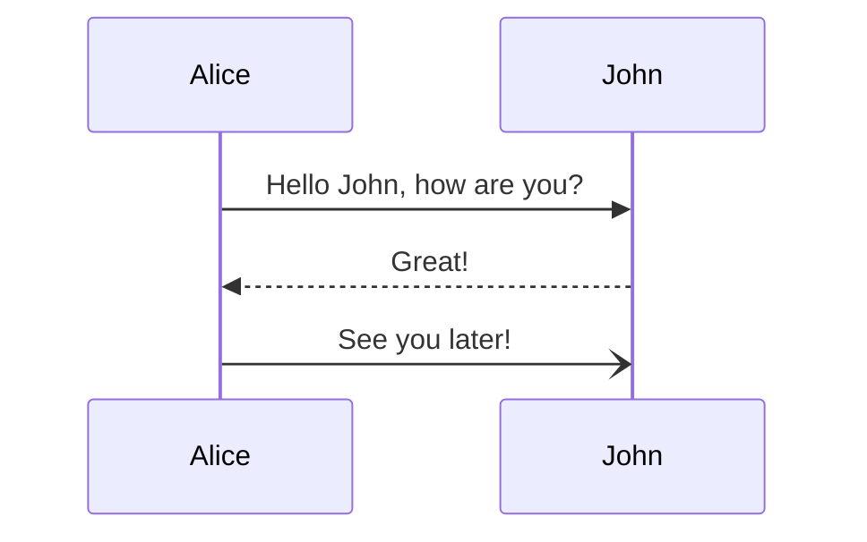

## Example 2

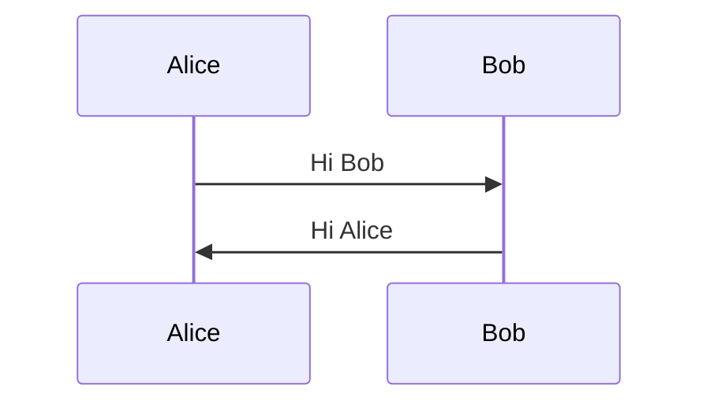

## Example 3

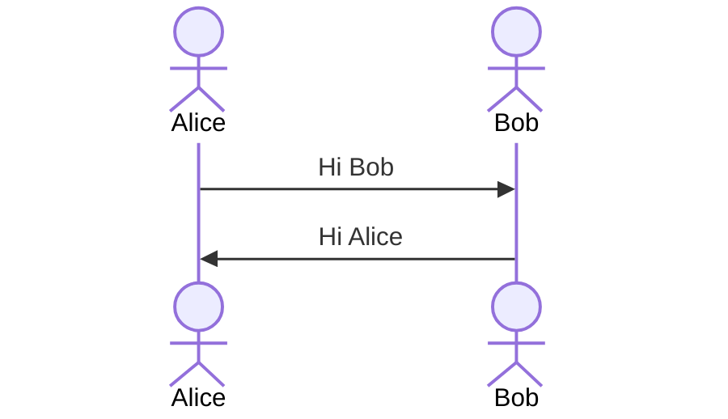

## Example 4

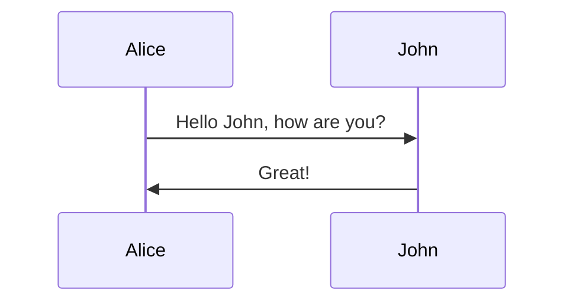

## Example 5

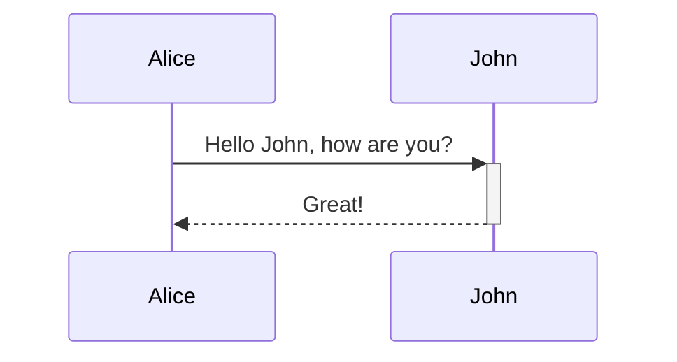

## Example 6

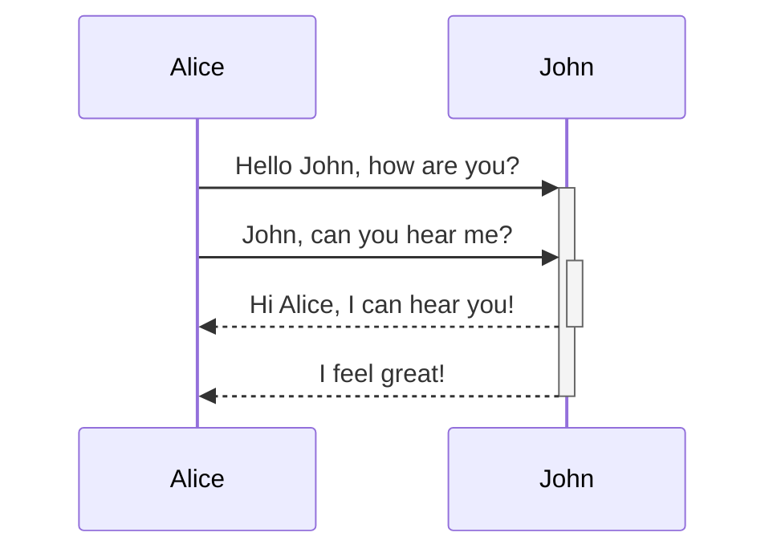

## Example 7

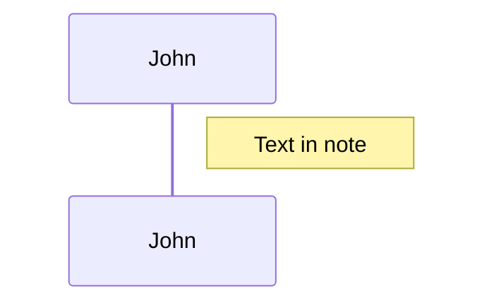

## Example 8

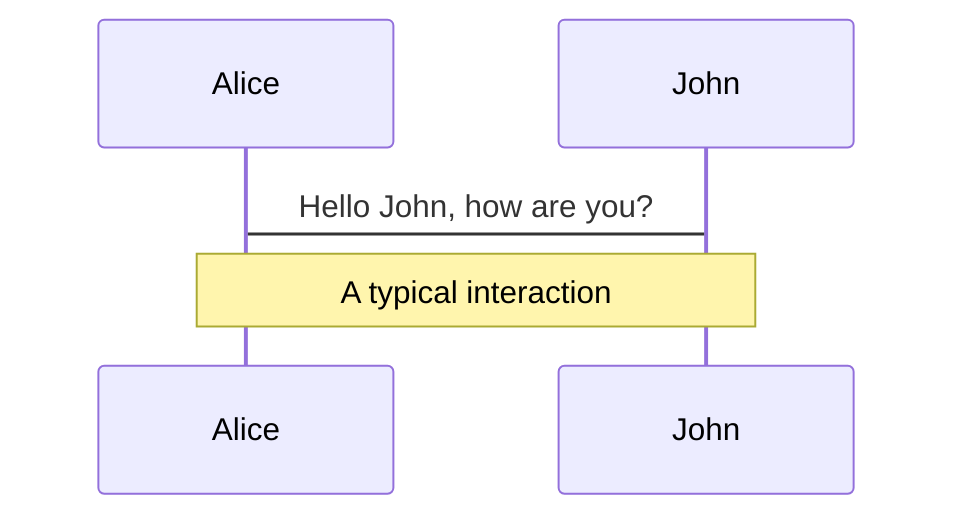

## Example 9

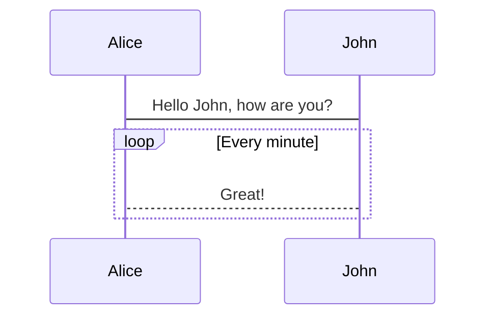

## Example 10

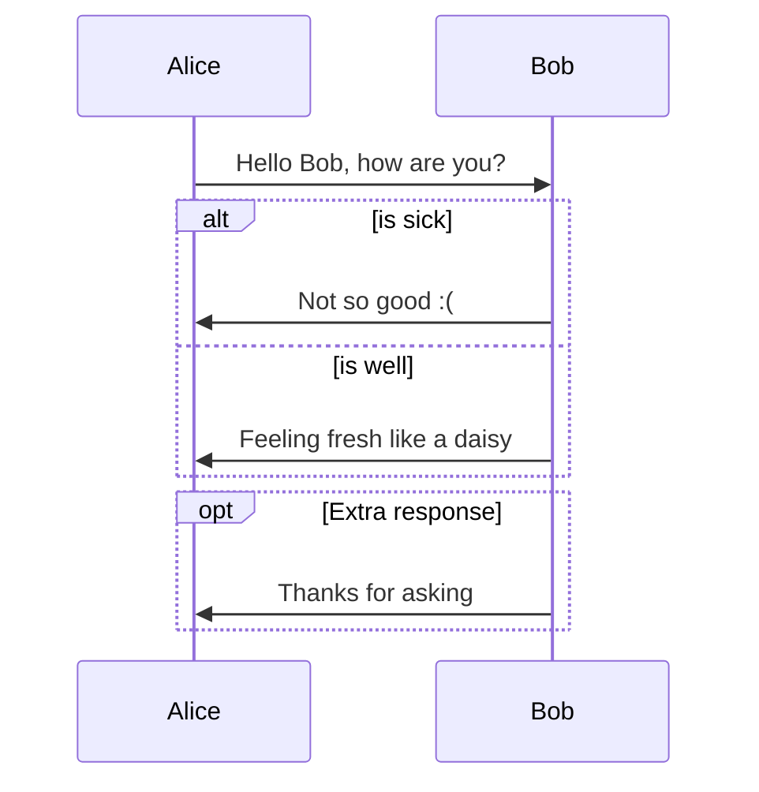

## Example 11

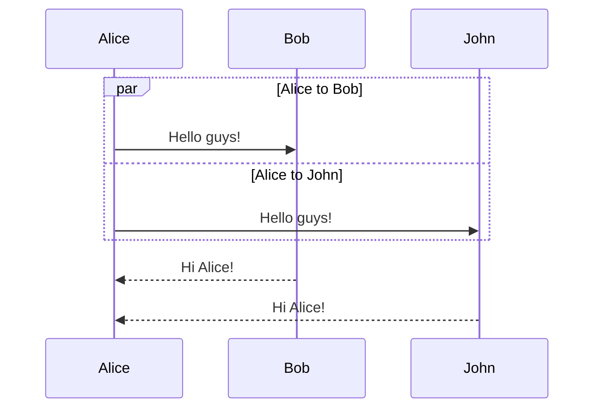

## Example 12

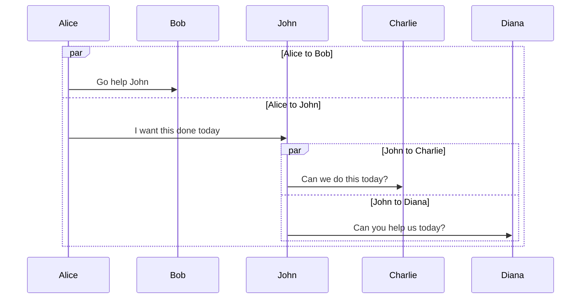

## Example 13

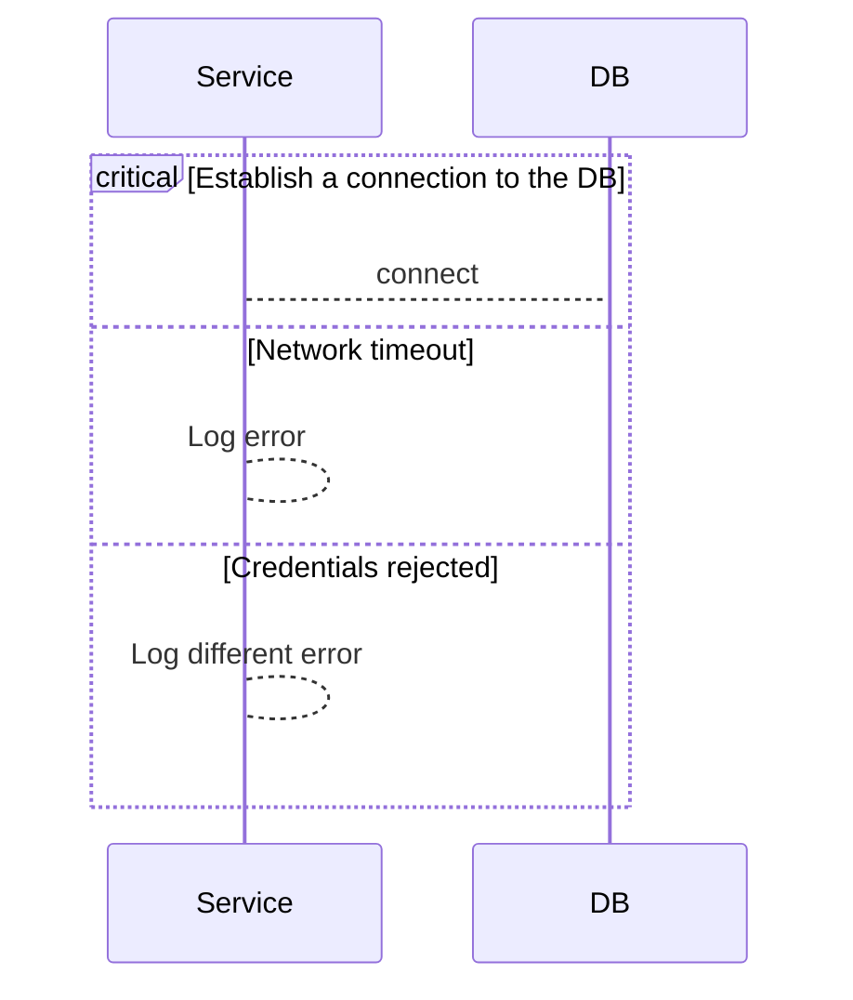

## Example 14

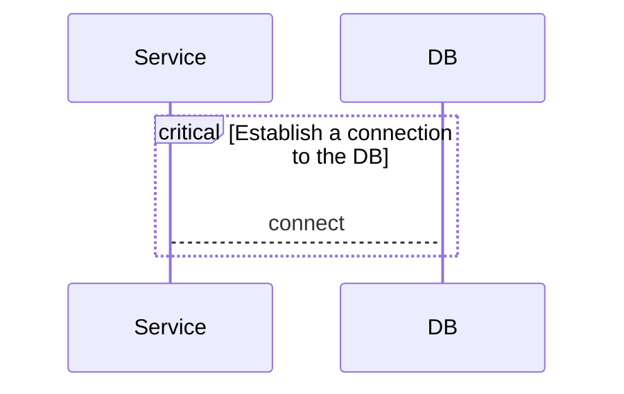

## Example 15

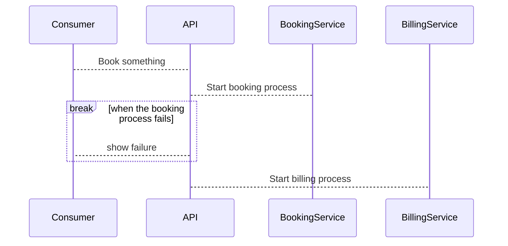

## Example 16

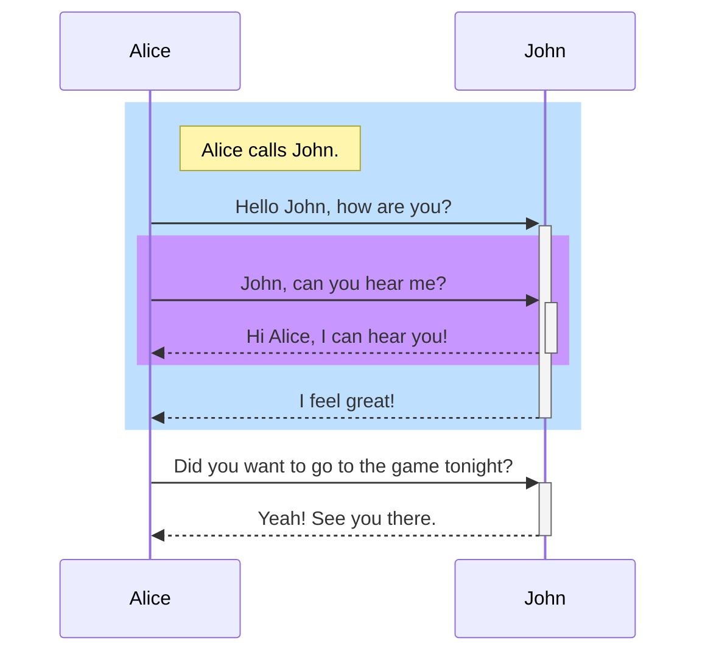

## Example 17

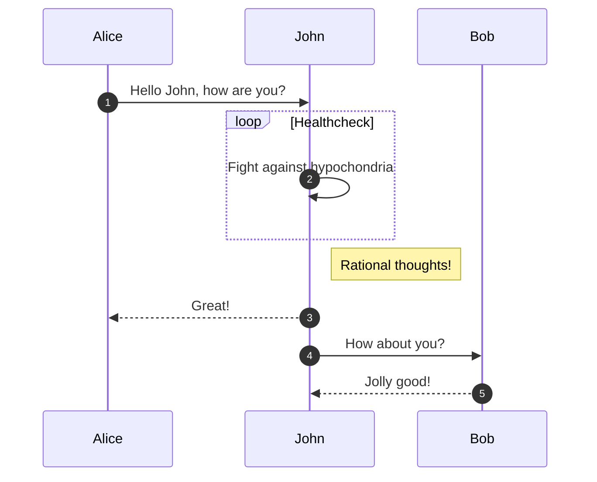
