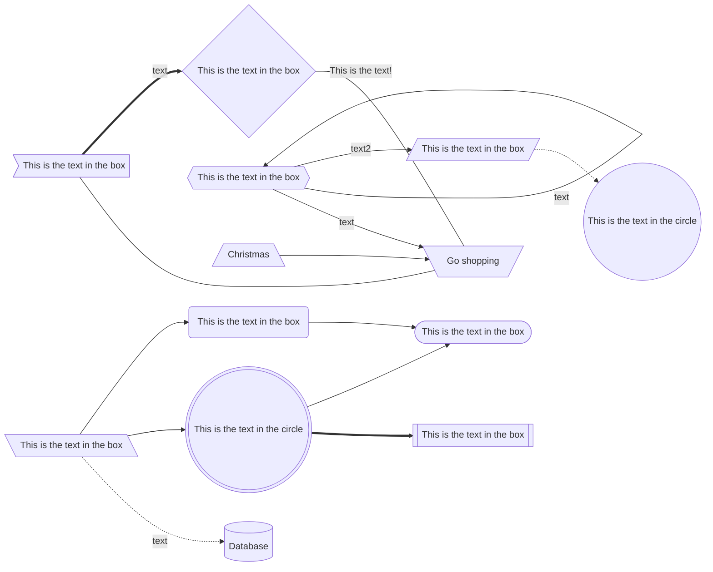
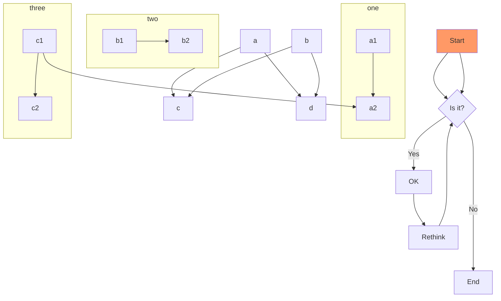
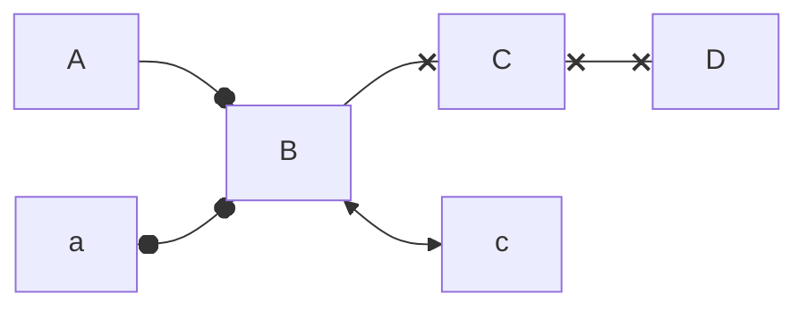
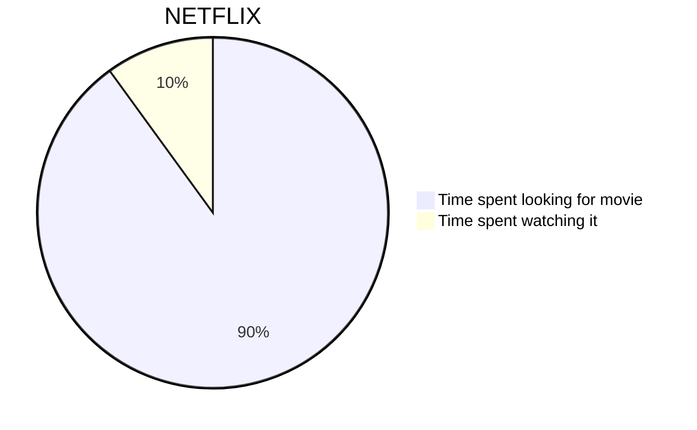
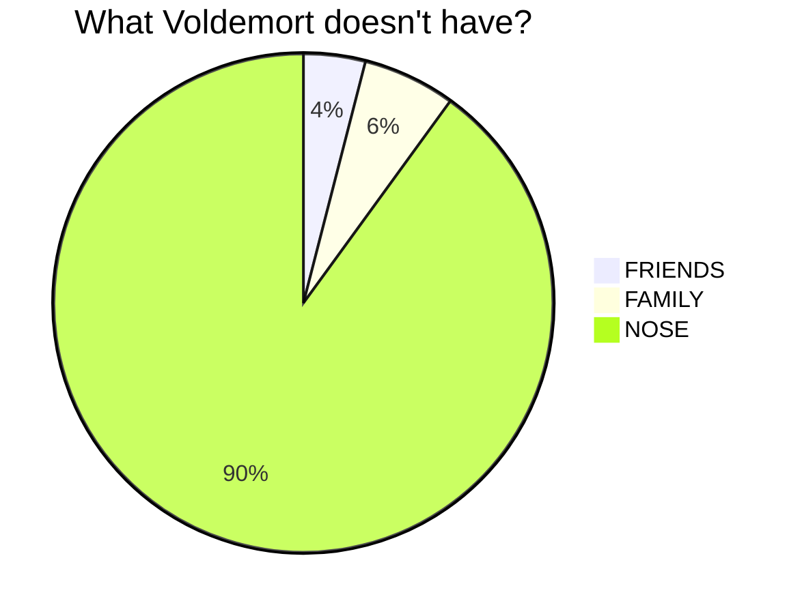
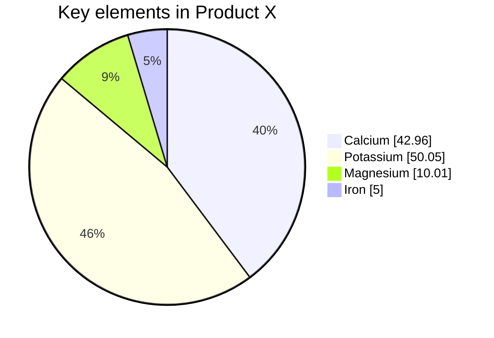

# Other diagrams

## Example 1 : Flowchart

```mermaid
flowchart LR
    id1>This is the text in the box]
    id2{This is the text in the box}
    id3{{This is the text in the box}}
    id4[/This is the text in the box/]
    id5[\This is the text in the box\]
    A[/Christmas\]
    B[\Go shopping/]
    id6(((This is the text in the circle)))
    id7(This is the text in the box)
    id8([This is the text in the box])
    id9[[This is the text in the box]]
    id10[(Database)]
    id11((This is the text in the circle))
    A-->B
    id1 --- B
    id2-- This is the text! ---B
    id3-->|text|B
    id4-.->id11
    id5-. text .-> id10
    id6==> id9
    id1== text ==>id2
    id3 -- text --> id3 -- text2 --> id4
    id5 --> id6 & id7--> id8
    
```

## Example 2 : Flowchart

```mermaid
flowchart TB
    a & b--> c & d
    A[Start] --> B{Is it?}
    B -->|Yes| C[OK]
    C --> D[Rethink]
    D --> B
    B ---->|No| E[End]
    c1-->a2
    subgraph one
    a1-->a2
    end
    subgraph two
    b1-->b2
    end
    subgraph three
    c1-->c2
    end
    A:::someclass --> B
    classDef someclass fill:#f96
```

## Example 3 : Flowchart

```mermaid
flowchart LR
    A --o B
    B --x C
    a o--o B
    B <--> c
    C x--x D

```

## Example 4 : Pie

```mermaid
pie title NETFLIX
         "Time spent looking for movie" : 90
         "Time spent watching it" : 10
```

## Example 5 : Pie

```mermaid
pie title What Voldemort doesn't have?
         "FRIENDS" : 2
         "FAMILY" : 3
         "NOSE" : 45
```

## Example 6 : Pie

```mermaid
pie showData
    title Key elements in Product X
    "Calcium" : 42.96
    "Potassium" : 50.05
    "Magnesium" : 10.01
    "Iron" :  5
```
